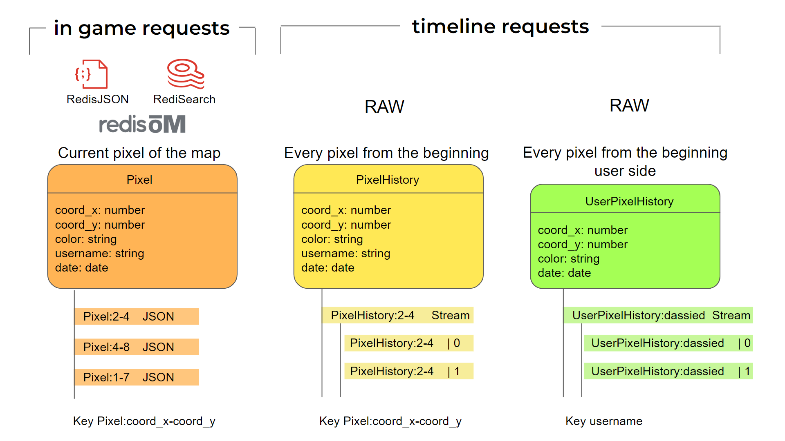
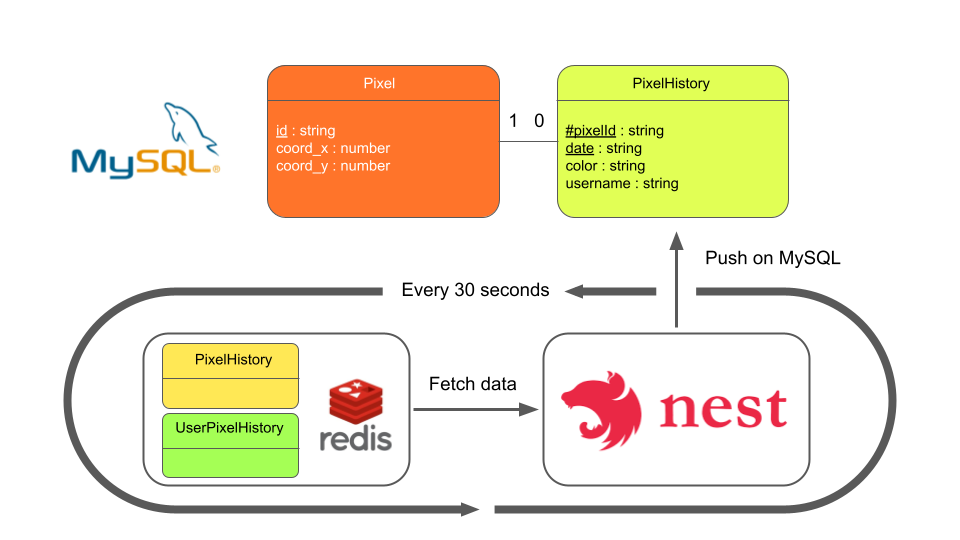

# r/place Backend

## The main project

We have 3 main parts :
* The [frontend](https://git.inpt.fr/dassied/rplace-frontend) - Application displayed on the user's screen
* The [backend](https://git.inpt.fr/dassied/rplace-backend) - Application and database managing data and handling requests
* The [infrastructure](https://git.inpt.fr/dassied/rplace-infra) - The support to maintain the application with high availability and to maintain a consistent load

## Backend server side for the r/place project

Tech stack :
* Back - [NestJS](https://nestjs.com/): to manage data and handle requests
* Database - [Redis](https://redis.io/): for temporary and persistent database

## Server

### Prerequisites

#### NestJS
- yarn installed
- nodeJS installed (>=16.10.0, use nvm to manage node versions)
#### Database
- docker installed

### Run server

Run Redis-stack database first in a terminal.
Redis-stack implements RedisJSON and RediSearch that's modules we use.
```bash
# run database
$ docker run -d --name redis-stack -p 6379:6379 -p 8001:8001 redis/redis-stack:latest
```
Got to `localhost:8001` to manage data with Redis Insight.

Run NestJS server (you need to be placed in this folder).
```bash
# development
$ yarn run start:dev
```

## Data structure

### Redis structure



### Global structure (redis and mysql)

