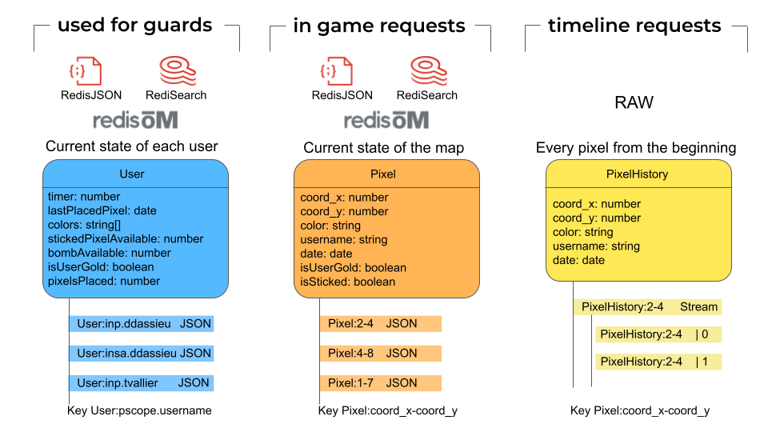
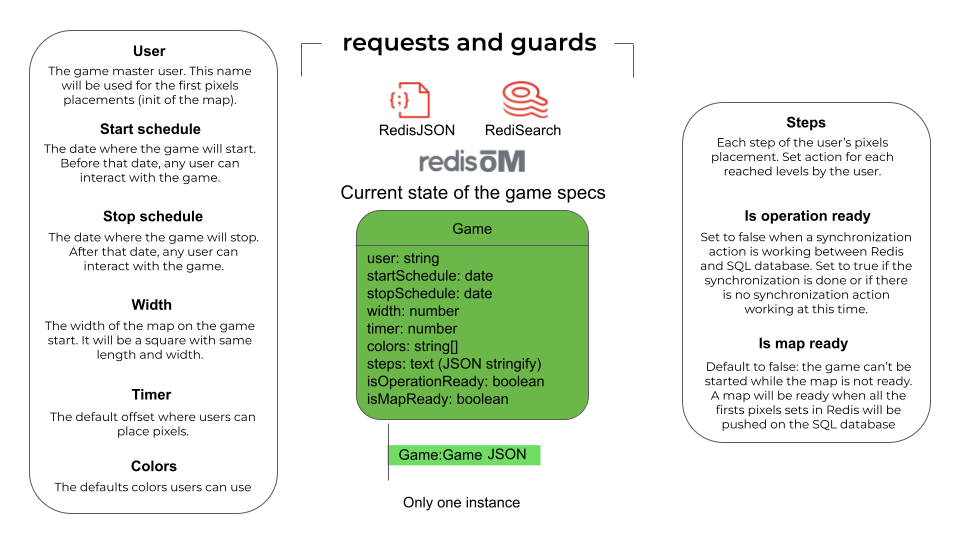
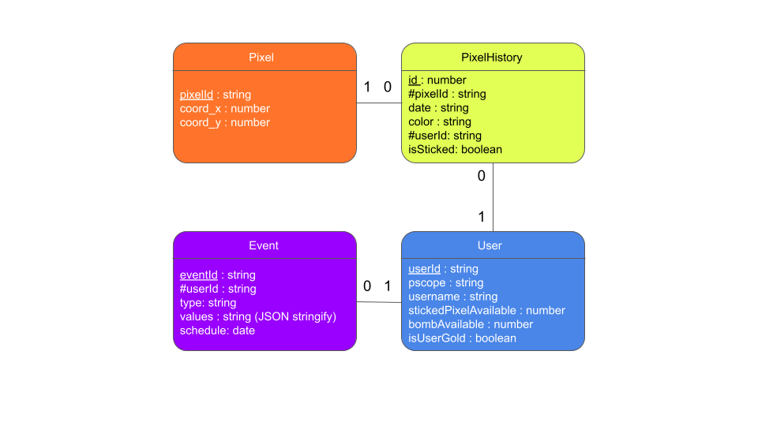
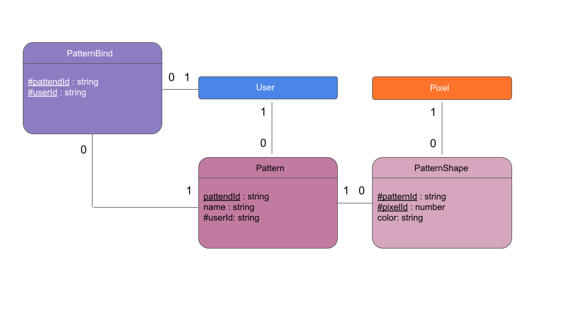
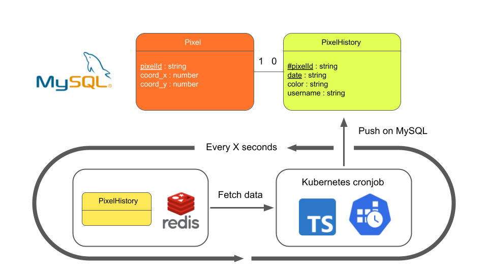

# r/place Backend

## The main project

We have 3 main parts :
* The [frontend](https://git.inpt.fr/dassied/rplace-frontend) - Application displayed on the user's screen
* The [backend](https://git.inpt.fr/dassied/rplace-backend) - Application and database managing data and handling requests
* The [infrastructure](https://git.inpt.fr/dassied/rplace-infra) - The support to maintain the application with high availability and to maintain a consistent load

## Backend server side for the r/place project

Tech stack :
* Back - [NestJS](https://nestjs.com/): to manage data and handle requests
* Database - [Redis](https://redis.io/) for the temporary database and [MariaDB](https://mariadb.org/) : for the persistent database

## Server

### Prerequisites

#### NestJS
- yarn installed
- nodeJS installed (>=16.10.0, use nvm to manage node versions)
#### Database
- docker installed

### Run server

Run Redis-stack database first in a terminal.
Redis-stack implements RedisJSON and RediSearch that's modules we use.
```bash
# run redis database
docker run -d --name redis-stack -p 6379:6379 -p 8001:8001 redis/redis-stack:latest
```
Got to `localhost:8001` to manage data with Redis Insight.

Then run MariaDB database
```bash
# run mariadb database
docker run -d --name mariadb --env MARIADB_ROOT_PASSWORD=password -p 3306:3306 mariadb:10.7.4-focal
docker exec -it mariadb /bin/bash
mysql -u root --password=password
CREATE DATABASE rplace;
USE rplace;
```

Finally, run NestJS server (you need to be placed in this folder).
```bash
# development
yarn run start:dev
```
Make call on api with `localhost:3000`.

## Data structure

### Redis structure



The game is an entity usable in the code.



### MariaDb structure





### Global structure (redis and mariadb)



## Middlewares / guards

Guards are used as middleware to allow user to do actions or not. These are the guards used for this application :

**Authentication**
- Local : allow connexion for a user thanks to the Toulouse Univ C.A.S and create a JWT
- Access token : allow connexion for a user with it's JWT access token
- Refresh token : allow connexion for a user with it's JWT refrsh token and create a new JWT
- Websocket : allow connexion for a user with it's JWT access token through socket io

**Pixel**
- Place pixel : allow user to place pixel depending on when the last pixel he places was placed, the timer (because it can be different from the global game timer), the color (user can have different colors available from the global game colors), the coordinates, the kind (sticked or not) and if the map is ready

**User**
- Role : used by game service, allow the user to interact with the game (start, stop, create and delete events) if the role is ADMIN

**Event**
- Role : check if the user is ADMIN